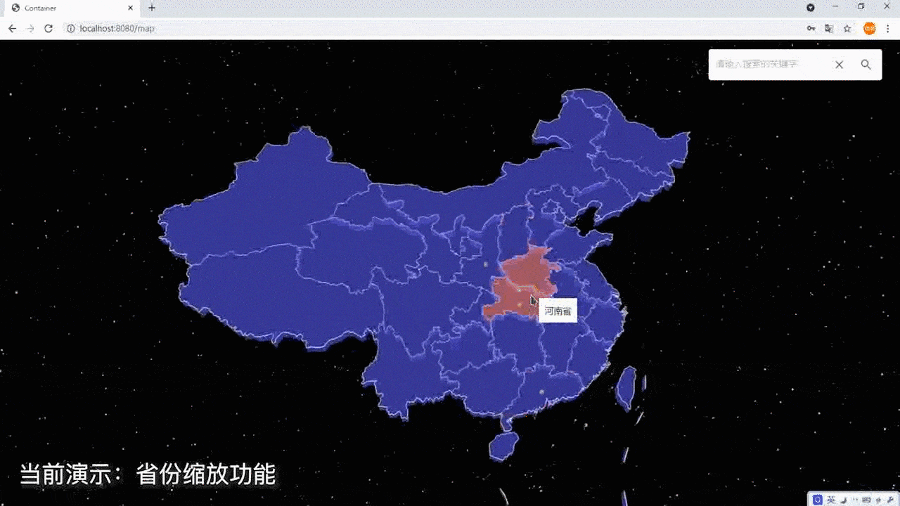
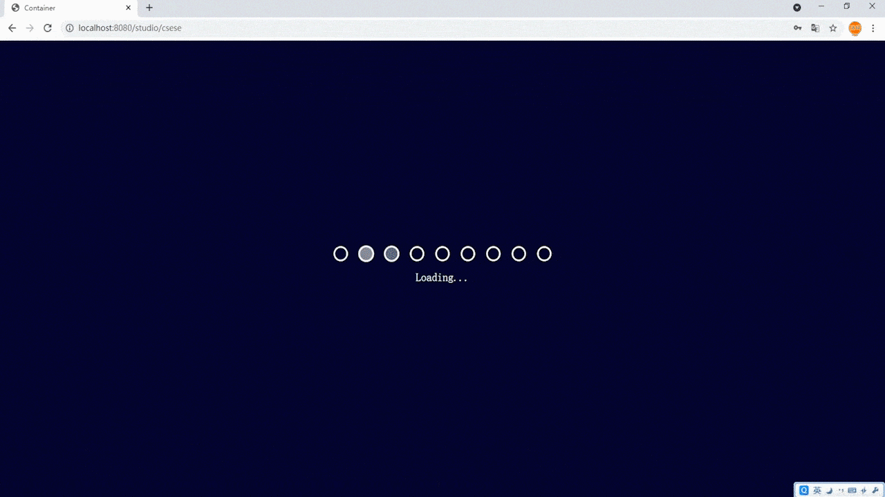

# 基于 React-three-fiber 的 Web3D 短视频网络教学平台

### 概要介绍

本项目是一款基于 React-three-fiber 构建的 Web3D 在线学习教育平台。用户能在 3D 场景中观看短视频、完成练习等，提高了学习的趣味性。
用户可在 3D 场景中通过选择学院、选择工作室、选择科目来学习自己想要的知识，以观看短视频、完成小测验作为学习的手段，并以任务进度法作为辅助学习的手段提供正反馈，从而激发学习兴趣。

### 应用演示

#### 3D 中国地图模块

  

#### 3D 学院内部场景模块

  
  

#### 3D 工作室内部场景模块

- 工作室一览

 

- 可交互屏幕

 

- 课程视频的选择

 

- 练习台

  
  

